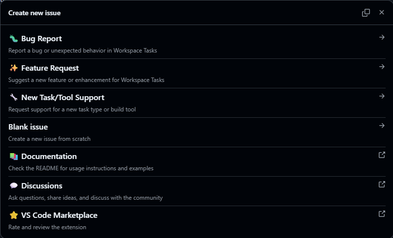

# Contributing to Workspace Tasks

Thank you for your interest in contributing to Workspace Tasks! Whether you're reporting a bug, requesting a feature, improving documentation, or submitting code changes, your contributions help make this extension better for everyone.

This guide will help you get started with contributing to the project.

## 📑 Table of Contents

- [Ways to Contribute](#ways-to-contribute)
- [Creating Good Issues](#creating-good-issues)
  - [Look for an Existing Issue](#look-for-an-existing-issue)
  - [Writing Good Bug Reports](#writing-good-bug-reports)
  - [Writing Good Feature Requests](#writing-good-feature-requests)
  - [Requesting New Task Type Support](#requesting-new-task-type-support)
- [Contributing Code](#contributing-code)
  - [Development Setup](#development-setup)
  - [Project Structure](#project-structure)
  - [Code Style Guidelines](#code-style-guidelines)
  - [Testing Your Changes](#testing-your-changes)
  - [Submitting a Pull Request](#submitting-a-pull-request)
- [Contributing Documentation](#contributing-documentation)
- [Code of Conduct](#code-of-conduct)

## Ways to Contribute

There are many ways you can contribute to Workspace Tasks:

### 🐛 Report Bugs

Found a bug? Help us fix it by creating a detailed bug report. See [Writing Good Bug Reports](#writing-good-bug-reports).

### ✨ Request Features

Have an idea for a new feature or enhancement? We'd love to hear it! See [Writing Good Feature Requests](#writing-good-feature-requests).

### 🔧 Request Task Type Support

Want support for a new build tool, task runner, or package manager? See [Requesting New Task Type Support](#requesting-new-task-type-support).

### 📝 Improve Documentation

Help make the documentation clearer, fix typos, or add examples. Documentation improvements are always welcome!

### 💻 Submit Code Changes

Fix bugs, implement features, or improve performance by submitting pull requests. See [Contributing Code](#contributing-code).

### 💬 Help Others

Answer questions in [GitHub Discussions](https://github.com/camalot/vscode-workspace-tasks/discussions) or help troubleshoot issues.

### ⭐ Spread the Word

- Star the repository on GitHub
- Leave a review on the [VS Code Marketplace](https://marketplace.visualstudio.com/items?itemName=darthminos.workspace-tasks)
- Share the extension with colleagues and friends

## Creating Good Issues

### Look for an Existing Issue

Before creating a new issue, please search [existing issues](https://github.com/camalot/vscode-workspace-tasks/issues) to see if the problem or request has already been reported.

- Scan through [open issues](https://github.com/camalot/vscode-workspace-tasks/issues)
- Check the [most popular feature requests](https://github.com/camalot/vscode-workspace-tasks/issues?q=is%3Aopen+is%3Aissue+label%3Aenhancement+sort%3Areactions-%2B1-desc)

If you find an existing issue that matches yours:

- Add a 👍 reaction to show your support
- Add relevant comments with additional context or information
- Avoid "+1" comments—use reactions instead

### Quick Issue Creation

You can create issues directly from VS Code:

1. Click the **GitHub icon** in the Workspace Tasks navigation bar
2. Select the appropriate issue type from the menu



This will open your browser to the appropriate issue template on GitHub.

### Writing Good Bug Reports

When reporting a bug, please include:

**Required Information:**

- **VS Code Version** - Help > About (or `code --version`)
- **Extension Version** - Found in Extensions view
- **Operating System** - Windows, macOS, or Linux (including version)
- **Reproducible Steps** - Clear numbered steps to reproduce the issue
  1. Open workspace with...
  2. Click on...
  3. See error...
- **Expected Behavior** - What you expected to happen
- **Actual Behavior** - What actually happened

**Helpful Additions:**

- **Screenshots or Recordings** - Visual evidence of the issue
- **Error Messages** - From Output panel (View > Output > Workspace Tasks)
- **Log Output** - Developer Tools Console (Help > Toggle Developer Tools)
- **Sample Project** - Link to a repository that reproduces the issue
- **Task Files** - Relevant snippets from `package.json`, `Makefile`, etc.
- **Configuration** - Your Workspace Tasks settings

**Example:**

```markdown
**Environment:**
- VS Code: 1.95.0
- Extension: 2.0.0
- OS: Windows 11

**Steps to Reproduce:**
1. Open workspace with package.json containing script "build": "tsc"
2. Click on "build" task in Workspace Tasks view
3. Task fails with error "tsc: command not found"

**Expected:** Task should run TypeScript compiler
**Actual:** Error message appears

**Additional Context:**
TypeScript is installed globally and works in terminal.
See attached screenshot showing the error.
```

### Writing Good Feature Requests

When requesting a feature, please describe:

- **Problem Statement** - What problem would this feature solve?
- **Proposed Solution** - How should this feature work?
- **Use Case** - How would you use this feature?
- **Alternatives Considered** - Other solutions you've tried
- **Examples** - Screenshots or mockups if applicable
- **Impact** - Who would benefit from this feature?

**Example:**

```markdown
**Feature:** Add keyboard shortcuts for running favorite tasks

**Problem:** I frequently run the same 5 tasks and have to click through the tree each time.

**Solution:** Allow assigning keyboard shortcuts (e.g., Ctrl+Shift+1) to favorite tasks for quick execution.

**Use Case:** As a developer working on microservices, I need to quickly restart different services. Being able to press Ctrl+Shift+1 for "Start API" and Ctrl+Shift+2 for "Start UI" would save significant time.

**Alternatives:** Currently using VS Code tasks.json, but I prefer the Workspace Tasks favorites system for organization.
```

### Requesting New Task Type Support

When requesting support for a new task type (build tool, task runner, package manager, etc.), please provide:

- **Tool Name and URL** - Official website or repository
- **Task File Format** - Which files contain tasks? (e.g., `build.gradle`, `Taskfile.yml`)
- **Task Discovery** - How are tasks defined in the file?
- **Common Usage** - How do developers typically use this tool?
- **Example Files** - Sample task files showing typical usage
- **Ecosystem Popularity** - How widely used is this tool?

**Example:**

```markdown
**Tool:** Bazel (https://bazel.build/)

**Task Files:** BUILD, BUILD.bazel, WORKSPACE

**Task Discovery:** Targets defined with rules like `java_binary()`, `py_test()`

**Usage:** `bazel build //path/to:target` or `bazel test //...`

**Example File:**
\`\`\`python
java_binary(
    name = "my-app",
    srcs = glob(["*.java"]),
)
\`\`\`

**Popularity:** Used by Google and many large-scale projects
```

## Contributing Code

### Development Setup

#### Prerequisites

- **Node.js** - Version 18.x or later
- **npm** - Comes with Node.js
- **Git** - For cloning the repository
- **VS Code** - Latest version recommended

#### Initial Setup

1. **Fork the Repository**

   Click the "Fork" button on the [GitHub repository](https://github.com/camalot/vscode-workspace-tasks)

2. **Clone Your Fork**

   ```bash
   git clone https://github.com/YOUR-USERNAME/vscode-workspace-tasks.git
   cd vscode-workspace-tasks
   ```

3. **Add Upstream Remote**

   ```bash
   git remote add upstream https://github.com/camalot/vscode-workspace-tasks.git
   ```

4. **Install Dependencies**

   ```bash
   npm install
   ```

5. **Open in VS Code**

   ```bash
   code .
   ```

#### Building and Running

1. **Start the Watch Task**

   Press `Ctrl+Shift+B` (or `Cmd+Shift+B` on macOS) to start the default build task, or run:

   ```bash
   npm run watch
   ```

   This will compile TypeScript files and watch for changes.

2. **Launch Extension Development Host**

   Press `F5` to open a new VS Code window with your extension loaded.

   Alternatively, go to Run and Debug view (`Ctrl+Shift+D`) and select "Run Extension".

3. **Make Changes**

   Edit source files in the `src/` directory. The watch task will automatically recompile.

4. **Reload Extension**

   In the Extension Development Host window:
   - Press `Ctrl+R` (or `Cmd+R` on macOS) to reload the extension after code changes
   - Or use Command Palette > "Developer: Reload Window"

### Project Structure

```text
vscode-workspace-tasks/
├── src/
│   ├── commands/          # Command implementations
│   ├── providers/         # Task provider implementations for each task type
│   ├── services/          # Core services (configuration, cache, favorites, etc.)
│   ├── libs/              # Utility libraries and constants
│   ├── common/            # Base classes and shared code
│   ├── extension.ts       # Extension entry point
│   ├── taskItem.ts        # Task tree item model
│   ├── taskProvider.ts    # Base task provider interface
│   └── taskTreeDataProvider.ts  # Tree view data provider
├── res/
│   ├── icons/             # Task type and UI icons
│   ├── schemas/           # JSON schemas for configuration files
│   └── syntaxes/          # Language grammars for .tasksignore and workspace-tasks.json
├── test/
│   └── suite/             # Test files
├── package.json           # Extension manifest and configuration
└── README.md              # User documentation
```

**Key Components:**

- **`extension.ts`** - Extension activation and registration
- **`providers/`** - Each task type (npm, gradle, make, etc.) has its own provider that discovers and creates tasks
- **`services/`** - Shared services for favorites, queues, configuration, caching
- **`commands/`** - Implementation of all commands (run task, add to favorites, etc.)
- **`taskTreeDataProvider.ts`** - Manages the tree view structure and organization

### Code Style Guidelines

This project follows specific coding conventions. Please adhere to these guidelines:

#### Naming Conventions

- **Files** - Use camelCase (e.g., `taskProvider.ts`, `gulpTaskProvider.ts`)
- **Classes** - Use PascalCase (e.g., `TaskProvider`, `NpmTaskProvider`)
- **Variables and Functions** - Use camelCase (e.g., `getTasks`, `taskItems`)
- **Constants** - Use UPPER_SNAKE_CASE (e.g., `MAX_DEPTH`, `DEFAULT_ICON`)

#### Code Standards

- **Line Length** - Maximum 120 characters
- **Indentation** - 2 spaces (configure your editor accordingly)
- **Quotes** - Use single quotes for strings unless double quotes are necessary
- **Semicolons** - Use semicolons at the end of statements
- **Comments** - Use JSDoc comments for public functions and classes

**Example:**

```typescript
/**
 * Discovers tasks from package.json files in the workspace.
 * @param workspaceFolder The workspace folder to search
 * @returns Array of discovered task items
 */
async function discoverPackageJsonTasks(workspaceFolder: vscode.WorkspaceFolder): Promise<TaskItem[]> {
  const tasks: TaskItem[] = [];
  const files = await vscode.workspace.findFiles('**/package.json', '**/node_modules/**');

  for (const file of files) {
    // Process each package.json file
    const content = await vscode.workspace.fs.readFile(file);
    // ...
  }

  return tasks;
}
```

#### TypeScript Guidelines

- Avoid using `any` type—prefer specific types or generics
- Use interfaces for object shapes
- Use enums for fixed sets of values
- Enable strict type checking

#### Git Commit Messages

Use [Conventional Commits](https://www.conventionalcommits.org/) format:

```text
<type>(<scope>): <subject>

<body>

<footer>
```

**Types:**

- `feat:` - New feature
- `fix:` - Bug fix
- `docs:` - Documentation changes
- `style:` - Code style changes (formatting, no logic change)
- `refactor:` - Code refactoring
- `perf:` - Performance improvements
- `test:` - Adding or updating tests
- `chore:` - Maintenance tasks, dependency updates

**Examples:**

```text
feat(npm): add support for pnpm workspaces

fix(queue): prevent duplicate tasks when adding to queue

docs(readme): update GitHub Actions integration section

chore(deps): update typescript to 5.3.0
```

### Testing Your Changes

Before submitting a pull request, test your changes thoroughly:

1. **Manual Testing**

   - Run the extension in the Extension Development Host (`F5`)
   - Test the specific functionality you changed
   - Try edge cases and error scenarios
   - Test with different workspace configurations

2. **Test Different Task Types**

   If your change affects task discovery or execution:
   - Create test workspaces with various task file types
   - Verify tasks are discovered correctly
   - Ensure tasks execute as expected

3. **Check for Regressions**

   - Test existing functionality to ensure nothing broke
   - Run common workflows (favorites, queues, task execution)

4. **Review Output and Logs**

   - Check Output panel (View > Output > Workspace Tasks)
   - Check Developer Tools Console (Help > Toggle Developer Tools)
   - Ensure no unexpected errors or warnings

5. **Test on Different Platforms (if possible)**

   - Windows, macOS, and Linux may behave differently
   - Consider file path differences and shell execution

### Submitting a Pull Request

Once your changes are ready:

1. **Update from Upstream**

   ```bash
   git fetch upstream
   git rebase upstream/develop
   ```

2. **Create a Feature Branch**

   ```bash
   git checkout -b feature/your-feature-name
   ```

   Or for bug fixes:

   ```bash
   git checkout -b fix/issue-description
   ```

3. **Commit Your Changes**

   ```bash
   git add .
   git commit -m "feat: add support for new task type"
   ```

4. **Push to Your Fork**

   ```bash
   git push origin feature/your-feature-name
   ```

5. **Open a Pull Request**

   - Go to your fork on GitHub
   - Click "Compare & pull request"
   - Select `camalot/vscode-workspace-tasks` `develop` branch as the base
   - Fill out the PR template with details about your changes

**Pull Request Guidelines:**

- **Clear Title** - Summarize the change in the PR title
- **Description** - Explain what you changed and why
- **Related Issues** - Reference any related issues (e.g., "Fixes #123")
- **Testing** - Describe how you tested your changes
- **Screenshots** - Include screenshots for UI changes
- **Documentation** - Update README.md or other docs if needed
- **Changelog** - Add entry to CHANGELOG.md following existing format

**Example PR Description:**

```markdown
## Description
Adds support for Bazel build tasks by implementing a new BazelTaskProvider.

## Related Issues
Closes #456

## Changes Made
- Created `bazelTaskProvider.ts` to discover Bazel BUILD files
- Added Bazel icon to `res/icons/`
- Updated configuration to include `bazel` in enabled task types
- Added Bazel documentation to README.md

## Testing
- Tested with sample Bazel workspace containing multiple BUILD files
- Verified tasks appear in tree view with correct hierarchy
- Confirmed task execution works with `bazel build` and `bazel test`
- Tested on Windows and Ubuntu

## Screenshots
[Screenshot showing Bazel tasks in tree view]
```

## Contributing Documentation

Documentation improvements are valuable contributions! You can help by:

- **Fixing Typos and Grammar** - Submit PRs for corrections
- **Clarifying Instructions** - Make setup or usage instructions clearer
- **Adding Examples** - Provide real-world usage examples
- **Updating Screenshots** - Replace outdated images
- **Expanding Sections** - Add more detail to existing documentation
- **Creating Guides** - Write tutorials or how-to guides

Documentation files to consider:

- `README.md` - Main user documentation
- `SUPPORT.md` - Support and help resources
- `CHANGELOG.md` - Release notes and version history
- Code comments and JSDoc

## Code of Conduct

### Our Commitment

We are committed to providing a welcoming and inclusive environment for all contributors. We expect all participants to:

- **Be Respectful** - Treat everyone with respect and kindness
- **Be Constructive** - Provide helpful feedback and suggestions
- **Be Patient** - Remember that people have different skill levels and backgrounds
- **Be Open-Minded** - Consider different perspectives and ideas
- **Be Professional** - Keep discussions focused and on-topic

### Unacceptable Behavior

The following behaviors are not tolerated:

- Harassment, intimidation, or discrimination
- Offensive comments or personal attacks
- Spam or off-topic discussions
- Publishing others' private information without consent
- Any conduct that could reasonably be considered inappropriate

### Reporting Issues

If you experience or witness unacceptable behavior, please report it by:

- Opening a private issue on GitHub
- Contacting the project maintainer directly

All reports will be handled with discretion and confidentiality.

## Questions?

If you have questions about contributing:

- 💬 Ask in [GitHub Discussions](https://github.com/camalot/vscode-workspace-tasks/discussions)
- 🐛 Check [existing issues](https://github.com/camalot/vscode-workspace-tasks/issues)
- 📚 Review the [README](README.md) and [SUPPORT](SUPPORT.md) documents

## Thank You

Your contributions make Workspace Tasks better for everyone. Whether you're fixing a typo, reporting a bug, or implementing a major feature, we appreciate your time and effort! 🎉

---

**Quick Links:**

- 🏠 [Project Homepage](https://github.com/camalot/vscode-workspace-tasks)
- 🐛 [Report a Bug](https://github.com/camalot/vscode-workspace-tasks/issues/new?template=bug_report.yml)
- ✨ [Request a Feature](https://github.com/camalot/vscode-workspace-tasks/issues/new?template=feature_request.yml)
- 💬 [GitHub Discussions](https://github.com/camalot/vscode-workspace-tasks/discussions)
- 📦 [VS Code Marketplace](https://marketplace.visualstudio.com/items?itemName=darthminos.workspace-tasks)
