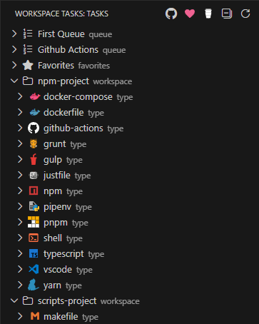
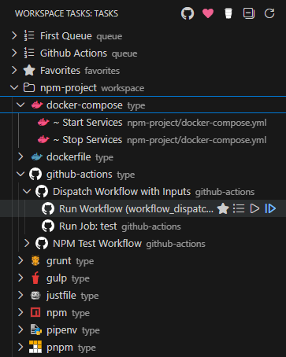
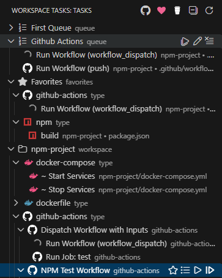

# Workspace Tasks

>[!NOTE] CURRENT STATUS IS **UNPUBLISHED**

[](https://marketplace.visualstudio.com/items?itemName=darthminos.workspace-tasks)

A powerful VS Code extension that automatically discovers, organizes, and runs tasks from your workspace. Manage build scripts, run tests, execute workflows, and organize your development tasks with favorites and queues—all from a single, intuitive interface.

 <!----> 

## 📑 Table of Contents

- [✨ Key Features](#-key-features)
- [🛠️ Supported Task Types](#️-supported-task-types)
- [⭐ Favorites](#-favorites)
- [📋 Task Queues](#-task-queues)
- [📥 Installation](#-installation)
- [🚀 Quick Start](#-quick-start)
- [⚙️ Configuration](#️-configuration)
  - [Custom Workspace Tasks](#custom-workspace-tasks)
  - [GitHub Actions Integration](#github-actions-integration)
  - [Task Ignore Patterns](#task-ignore-patterns)
- [🔧 Advanced Features](#-advanced-features)
- [📋 Requirements](#-requirements)
- [🤝 Contributing](#-contributing)
- [📄 License](#-license)

## ✨ Key Features

- **🔍 Automatic Task Discovery** - Scans your workspace for tasks from 20+ file types and build systems
- **⭐ Favorites** - Pin frequently used tasks for instant access
- **📋 Multiple Task Queues** - Create and manage named sequences of tasks
- **▶️ One-Click Execution** - Run tasks directly from the sidebar with visual status indicators
- **🎯 Smart Organization** - Hierarchical tree view organized by workspace, task type, and file
- **🔀 Drag & Drop** - Reorder tasks in queues with drag and drop
- **🎭 GitHub Actions Support** - Run GitHub Actions workflows locally with [act](https://github.com/nektos/act)
- **📝 Custom Tasks** - Define reusable task templates with dynamic inputs
- **🚫 Task Filtering** - Use `.tasksignore` files to exclude unwanted tasks
- **💾 Persistent State** - Favorites and queues are saved across VS Code sessions

## 🛠️ Supported Task Types

Workspace Tasks automatically discovers and organizes tasks from a wide variety of tools and frameworks:

### Package Managers & Build Tools

<p align="left">
  
  
  
  
  
  
  
  
</p>

- **[npm](https://www.npmjs.com/)** - Scripts from `package.json`
- **[Yarn](https://yarnpkg.com/)** - Scripts from `package.json`
- **[pnpm](https://pnpm.io/)** - Scripts from `package.json`
- **[Composer](https://getcomposer.org/)** - PHP scripts from `composer.json`
- **[Pipenv](https://pipenv.pypa.io/)** - Python scripts from `Pipfile`
- **[Apache Ant](https://ant.apache.org/)** - Targets from `*.xml` build files
- **[Gradle](https://gradle.org/)** - Tasks from `*.gradle` files
- **[MSBuild](https://docs.microsoft.com/en-us/visualstudio/msbuild/msbuild)** - .NET project targets

### Task Runners

<p align="left">
  
  
  
</p>

- **[Gulp](https://gulpjs.com/)** - Tasks from `gulpfile.js` or `gulpfile.mjs`
- **[Grunt](https://gruntjs.com/)** - Tasks from `Gruntfile.js`
- **[Just](https://github.com/casey/just)** - Recipes from `justfile` or `*.just` files
- **[Make](https://www.gnu.org/software/make/)** - Targets from `Makefile`

### DevOps & Containers

<p align="left">
  
</p>

- **[Docker](https://www.docker.com/)** - Build tasks from `Dockerfile`
- **[Docker Compose](https://docs.docker.com/compose/)** - Services from `docker-compose.yml`
- **[GitHub Actions](https://github.com/features/actions)** - Workflows from `.github/workflows/*.yml` (via [act](https://github.com/nektos/act))

### Scripts & Other

<p align="left">
  
  
  
</p>

- **Shell Scripts** - `.sh`, `.bash`, `.zsh`, `.fish`, `.ps1`, `.bat`, `.cmd`
- **Python Virtual Environments** - Activation scripts in `.venv/Scripts/`
- **VS Code Tasks** - Tasks from `.vscode/tasks.json`
- **Workspace Tasks** - Custom tasks from `.workspace-tasks.json`

> **Note:** The extension discovers tasks regardless of whether tools are installed. Execution requires the respective tool to be available in your PATH. See [Requirements](#-requirements) for details.


## ⭐ Favorites

Pin your most frequently used tasks for instant access. Favorites appear in a dedicated section at the top of the task tree, making your common operations just one click away.

**How to Use:**

1. Click the star icon (☆) next to any task to add it to favorites
2. Access all favorited tasks from the "Favorites" group at the top
3. Click the filled star (⭐) to remove from favorites

**Features:**

- **Quick Access** - All favorites in one place, organized by task type
- **Persistent** - Saved automatically across VS Code sessions
- **Workspace-Specific** - Each workspace maintains its own favorites list
- **Visual Indicators** - Star icons show in both favorites section and original location
- **Context Display** - Tasks show their workspace folder name in multi-root workspaces

**Perfect For:**

- Build, test, and deploy tasks you use daily
- Development scripts you run frequently
- Tasks from different workspace folders you need regularly

## 📋 Task Queues

Create and manage multiple named queues to run sequences of tasks in order. Perfect for complex workflows like CI/CD pipelines, multi-step builds, or deployment sequences.

**How to Use:**

1. Click the list icon next to any task
2. Choose an existing queue or create a new one
3. Drag and drop tasks to reorder them
4. Run the entire queue or start from a specific task

**Features:**

- **Multiple Queues** - Create separate queues for different workflows (e.g., "Build", "Deploy", "CI Pipeline")
- **Drag & Drop Reordering** - Easily reorder tasks within and across queues
- **Visual Context** - Each queue item shows the task icon, label, workspace name, and file path
- **Queue Controls** - Run entire queue, start from specific task, or stop execution
- **Queue Management** - Rename queues, clear all tasks, or delete empty queues
- **Persistent Storage** - Queues are saved and restored between sessions
- **Status Indicators** - Real-time visual feedback with running/success/failure icons

**Example Workflow:**

```text
CI Pipeline Queue:
1. Install Dependencies (npm install)
2. Lint Code (npm run lint)
3. Run Tests (npm test)
4. Build Production (npm run build)
5. Deploy to Staging (deploy.sh)
```

Click on the navigation items for the queue to run all tasks in sequence, rename the queue, or clear it.

## 📥 Installation

### From VS Code Marketplace

1. Open VS Code
2. Go to Extensions view (`Ctrl+Shift+X` / `Cmd+Shift+X`)
3. Search for "Workspace Tasks"
4. Click **Install**

### From Command Line

```bash
code --install-extension darthminos.workspace-tasks
```

### Requirements

- **VS Code** 1.108.1 or later
- **External tools** must be installed for task execution (see [Requirements](#-requirements) section)

## 🚀 Quick Start

1. **Open a workspace** with supported task files (e.g., `package.json`, `Makefile`, shell scripts)
2. **Open the Workspace Tasks view** from the Activity Bar (sidebar)
3. **Browse tasks** organized by workspace folder and task type
4. **Run a task** by clicking the play icon (▶️)
5. **Add to favorites** by clicking the star icon (☆)
6. **Create a queue** by clicking the list icon to organize task sequences

**Tips:**

- Double-click a task to open its definition file
- Use the collapse button (⊟) to toggle view states
- Create `.tasksignore` files to exclude unwanted tasks

## ⚙️ Configuration

### Custom Workspace Tasks

Create a `.workspace-tasks.json` file in your workspace to define custom reusable tasks with dynamic inputs. This is perfect for tasks that don't fit existing file types or need variable substitution.

#### Basic Example

```json
{
  "shell": {
    "version": "2.0.0",
    "tasks": [
      {
        "label": "Clean Build Artifacts",
        "type": "workspace",
        "command": "rm -rf dist build out",
        "group": "build"
      }
    ]
  }
}
```

#### File-Associated Tasks with Inputs

Tasks can be associated with file patterns and accept user inputs:

```json
{
  "dockerfile": {
    "version": "2.0.0",
    "globs": {
      "include": ["{**/Dockerfile,**/dockerfile,**/*.dockerfile}"],
      "exclude": ["**/node_modules/**", "**/.git/**"]
    },
    "inputs": [
      {
        "id": "Name",
        "type": "promptString",
        "description": "Enter the name for the Docker image",
        "default": "${workspaceFolderBasename}"
      },
      {
        "id": "Tag",
        "type": "promptString",
        "description": "Enter the tag for the Docker image",
        "default": "latest"
      }
    ],
    "tasks": [
      {
        "label": "Build Docker Image",
        "type": "workspace",
        "command": "docker build -t {{ .Name }}:{{ .Tag }} .",
        "group": "build"
      }
    ]
  }
}
```

#### Schema Reference

- **Top-level keys** - Task type identifiers (e.g., `dockerfile`, `shell`)
- **version** - Schema version (`"2.0.0"`)
- **globs** (optional) - File pattern matching
  - **include** - Array of glob patterns to match
  - **exclude** - Array of glob patterns to ignore
- **inputs** - Array of input definitions
  - **id** - Unique input identifier
  - **type** - `promptString` or `pickString`
  - **description** - Prompt text for user
  - **default** - Default value (supports `${workspaceFolderBasename}`)
  - **options** - Array of choices (for `pickString`)
- **tasks** - Array of task definitions
  - **label** - Display name
  - **type** - Must be `"workspace"`
  - **command** - Shell command (use `{{ .InputId }}` for variables)
  - **group** - Task group (`"build"`, `"test"`, etc.)

### GitHub Actions Integration

Run GitHub Actions workflows locally using [act](https://github.com/nektos/act) to test workflows without pushing to GitHub. Workspace Tasks provides a rich interface for executing workflows with full input support.

#### Features

- **Automatic Discovery** - Scans `.github/workflows/*.yml` files
- **Event Support** - Run workflows for `push`, `pull_request`, `workflow_dispatch`, and custom events
- **Job Execution** - Run individual jobs from multi-job workflows
- **Input Prompts** - Interactive prompts for `workflow_dispatch` inputs with validation
- **Status Indicators** - Real-time visual feedback during execution

#### Configuration

Configure act in your VS Code settings (`settings.json`):

```jsonc
{
  // Path to act executable
  "workspaceTasks.applicationPath.act": "act",

  // Environment files
  "workspaceTasks.act.envFile": ".env",
  "workspaceTasks.act.secretsFile": ".act.secrets",
  "workspaceTasks.act.variablesFile": ".act.vars",

  // Inline variables
  "workspaceTasks.act.variables": {
    "ENVIRONMENT": "development",
    "VERSION": "1.0.0"
  }
}
```

#### Usage Example

Given a workflow `.github/workflows/build.yml`:

```yaml
name: Build & Test
on:
  push:
  workflow_dispatch:
    inputs:
      environment:
        description: 'Deployment environment'
        required: true
        default: 'staging'
        type: choice
        options: [development, staging, production]

jobs:
  build:
    runs-on: ubuntu-latest
    steps:
      - uses: actions/checkout@v3
      - run: npm run build
```

The task tree shows:

```
GitHub Actions
└── Build & Test
    ├── Run Workflow (push)
    ├── Run Workflow (workflow_dispatch)  ← Shows input prompts
    └── Run Job: build
```

**Requirements:**

- [act](https://github.com/nektos/act) installed on your system
- [Docker](https://www.docker.com/) running (act uses containers)
- Configure `workspaceTasks.applicationPath.act` if act is not in PATH

**Tips:**

- Store secrets in `.act.secrets` and add to `.gitignore`
- Test `workflow_dispatch` inputs locally before pushing
- Run individual jobs to debug specific workflow steps

### Task Ignore Patterns

Control task discovery using `.tasksignore` files (similar to `.gitignore`). This keeps your task list focused on relevant tasks.

#### How It Works

- **Per-Directory Control** - Place `.tasksignore` in any directory to exclude files from that location and subdirectories
- **Gitignore Syntax** - Uses standard gitignore pattern syntax
- **Global Exclusions** - Configure workspace-wide exclusions in VS Code settings
- **Smart Defaults** - `**/node_modules/**` is automatically excluded

#### Example `.tasksignore`

```ignore
# Ignore all test scripts
**/test/**
**/*.test.sh

# Ignore build output
build/
dist/
out/

# Ignore temporary files
*.tmp
*.bak
```

#### Global Configuration

Add workspace-wide exclusions in `settings.json`:

```json
{
  "workspaceTasks.exclude": [
    "**/.git/**",
    "**/vendor/**",
    "**/__pycache__/**"
  ]
}
```

> **Note:** `**/node_modules/**` is automatically excluded for all task types.

## 🔧 Advanced Features

### Execution and Navigation

**Running Tasks:**

- **Single Click** - Click the play button (▶️) to run immediately
- **Terminal Output** - Task output appears in the integrated terminal with status indicators
- **Multiple Tasks** - Run multiple tasks simultaneously in separate terminals
- **Command Palette** - Use `Ctrl+Shift+P` / `Cmd+Shift+P` to search and run tasks by name

**Stopping Tasks:**

- **Stop Button** - Click the stop button (⏹) next to running tasks
- **Force Stop** - Forcefully terminate unresponsive tasks
- **Status Tracking** - Visual indicators show running/success/failure states

**Navigation:**

- **Quick File Access** - Double-click tasks to jump to their definition in the source file
- **Line Precision** - Opens files at the exact line where tasks are defined
- **File Path Display** - Hover over tasks to see full paths and commands
- **Hierarchical Browsing** - Tree structure shows workspace → task type → individual tasks

**Additional Actions:**

- **Refresh Tasks** - Manually refresh to pick up changes without reloading VS Code
- **Collapse/Expand** - Use the collapse all button (⊟) to toggle view states:
  - First click: Collapse task type groups
  - Second click: Collapse workspace folders
  - Third click: Expand everything

### Supported File Patterns

Each task type watches specific file patterns:

| Task Type | Patterns | Notes |
|-----------|----------|-------|
| npm/yarn/pnpm | `**/package.json` | Reads `scripts` section |
| Ant | `**/*.xml` | Parses build file targets |
| Composer | `**/composer.json` | PHP dependency scripts |
| Gradle | `**/*.gradle` | Java/Android build tasks |
| Grunt | `**/Gruntfile.js` | Registered tasks |
| Gulp | `**/gulpfile.{js,mjs}` | Exported tasks |
| Just | `**/{justfile,.justfile,*.just}` | Command recipes |
| Make | `**/Makefile` | Build targets |
| MSBuild | `**/*.{csproj,vbproj,sln}` | .NET project targets |
| Pipenv | `**/Pipfile` | Python scripts |
| Shell | `**/*.{sh,bash,ps1,bat,cmd}` | Executable scripts |
| Docker | `**/Dockerfile*` | Container builds |
| Docker Compose | `**/docker-compose.yml` | Service orchestration |
| GitHub Actions | `**/.github/workflows/*.yml` | CI/CD workflows |
| VS Code | `**/.vscode/tasks.json` | Native VS Code tasks |
| Workspace | `.workspace-tasks.json` | Custom tasks |

All patterns respect `.gitignore` and `.tasksignore` exclusions.

## 📋 Requirements

### VS Code Version

- **Minimum:** VS Code 1.108.1 or later

### External Tools

The extension discovers tasks regardless of whether tools are installed, but **execution requires** the corresponding tool in your system PATH:

**Package Managers:**
- [Node.js](https://nodejs.org/) and [npm](https://www.npmjs.com/) for npm tasks
- [pnpm](https://pnpm.io/) for pnpm tasks
- [Yarn](https://yarnpkg.com/) for Yarn tasks
- [Composer](https://getcomposer.org/) for PHP Composer tasks
- [Pipenv](https://pipenv.pypa.io/) for Python Pipenv tasks

**Build Systems:**
- [Apache Ant](https://ant.apache.org/) for Ant tasks
- [Gradle](https://gradle.org/) for Gradle tasks
- [MSBuild](https://docs.microsoft.com/en-us/visualstudio/msbuild/msbuild) for .NET tasks
- [Make](https://www.gnu.org/software/make/) for Makefile tasks

**Task Runners:**
- [Grunt](https://gruntjs.com/) for Grunt tasks
- [Gulp](https://gulpjs.com/) for Gulp tasks
- [Just](https://github.com/casey/just) for Just tasks

**DevOps:**
- [Docker](https://www.docker.com/) for Docker and Docker Compose tasks
- [act](https://github.com/nektos/act) and Docker for GitHub Actions workflows

**Scripts:**
- Bash, Zsh, or other shell interpreters for shell scripts
- PowerShell for `.ps1` scripts
- Command Prompt for `.bat` and `.cmd` scripts

> **Installation Instructions:** Visit each tool's official website (linked above) for installation guides specific to your operating system.

## 🤝 Contributing

Contributions are welcome! If you'd like to improve Workspace Tasks, here's how:

### How to Contribute

1. **Report Issues** - Found a bug or have a feature request? [Open an issue](https://github.com/camalot/vscode-workspace-tasks/issues) on GitHub
2. **Submit Pull Requests** - Fork the repository, make your changes, and submit a PR
3. **Improve Documentation** - Help make the docs clearer or add examples
4. **Share Feedback** - Let us know how you use the extension and what could be better

### Development Setup

```bash
# Clone the repository
git clone https://github.com/camalot/vscode-workspace-tasks.git
cd vscode-workspace-tasks

# Install dependencies
npm install

# Open in VS Code
code .

# Start the watch task to compile TypeScript
npm run watch

# Press F5 to launch the Extension Development Host
```

### Guidelines

- Follow the existing code style and conventions
- Write clear commit messages
- Add tests for new features when applicable
- Update documentation for user-facing changes
- Ensure all tests pass before submitting

### Project Structure

- `src/` - TypeScript source code
  - `providers/` - Task providers for each task type
  - `services/` - Shared services (caching, configuration, etc.)
  - `libs/` - Utility libraries
- `res/` - Resources (icons, schemas, syntaxes)
- `sample/` - Sample workspaces for testing

## 📄 License

This project is licensed under the [Apache 2.0 License](LICENSE).

---

**Made with ❤️ for the VS Code community**
